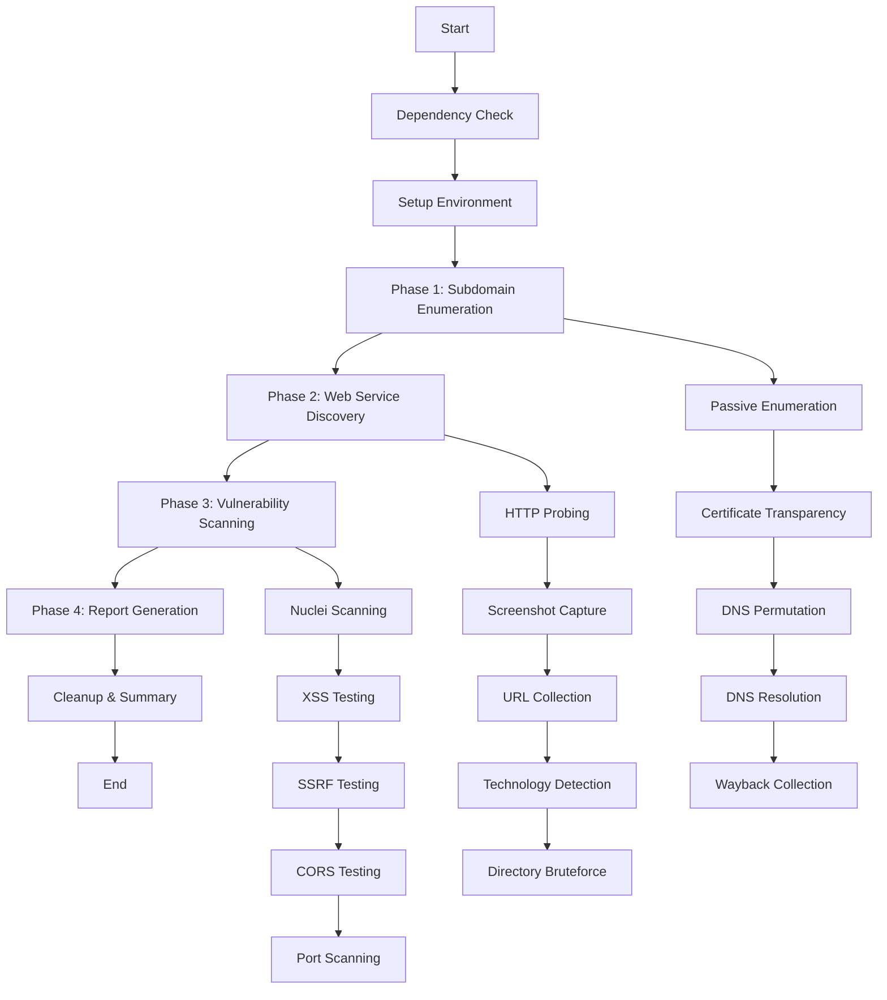

# Currently in development, I'm suggesting to wait until finished

# AutoRecon v2.0

AutoRecon is a comprehensive automated reconnaissance tool designed for security professionals and bug bounty hunters. It performs multi-phase reconnaissance including subdomain enumeration, web service discovery, and vulnerability scanning.

## 📋 Prerequisites

### Required Tools
```bash
# Core enumeration tools
go install -v github.com/projectdiscovery/subfinder/v2/cmd/subfinder@latest
go install -v github.com/tomnomnom/assetfinder@latest
go install -v github.com/projectdiscovery/httpx/cmd/httpx@latest
go install -v github.com/projectdiscovery/nuclei/v2/cmd/nuclei@latest
go install -v github.com/sensepost/gowitness@latest

# Additional tools
go install github.com/cgboal/sonarsearch/cmd/crobat@latest
go install -v github.com/projectdiscovery/shuffledns/cmd/shuffledns@latest
go install -v github.com/Emoe/kxss@latest
go install -v github.com/lc/gau/v2/cmd/gau@latest
go install -v github.com/tomnomnom/waybackurls@latest
go install -v github.com/projectdiscovery/naabu/v2/cmd/naabu@latest

# Vulnerability testing tools
go install -v github.com/hahwul/dalfox/v2@latest
go install -v github.com/ffuf/ffuf@latest
```

### Optional Tools
- `amass` - Additional subdomain enumeration
- `dnsgen` - Subdomain permutation
- `gf` - Pattern matching for URLs
- `qsreplace` - Query string replacement
- `CorsMe` - CORS testing
- `ppmap` - Prototype pollution testing

## 🏗️ Architecture

### Module Structure
```
bug-recon/
├── autorecon.sh           # Main orchestrator script
├── config.sh              # Configuration and settings
├── utils.sh               # Utility functions and logging
├── subdomain_enum.sh      # Subdomain enumeration module
├── web_enum.sh            # Web service enumeration module
├── vulnerability_scan.sh  # Vulnerability scanning module
├── report_generator.sh    # Report generation module
└── README.md              # This documentation
```

### Pipeline Flow



## 🎯 Usage

### Basic Usage
```bash
# Simple scan
./autorecon.sh -d example.com

# Scan with subdomain permutation
./autorecon.sh -d example.com -a

# Scan with directory bruteforcing
./autorecon.sh -d example.com -b

# Full vulnerability scan
./autorecon.sh -d example.com -v nuclei,xss,ssrf,cors
```

### Advanced Usage
```bash
# Custom output directory and threading
./autorecon.sh -d example.com -o /tmp/scans -t 20 -r 15

# Comprehensive scan with all features
./autorecon.sh -d example.com -a -b -v nuclei,xss,ssrf,cors,sqli,port

# Verbose logging
./autorecon.sh -d example.com --verbose

# Custom configuration
./autorecon.sh -d example.com --config custom_config.sh
```

### Command Line Options

| Option | Description | Example |
|--------|-------------|---------|
| `-d, --domain` | Target domain (required) | `-d example.com` |
| `-a, --alt` | Enable subdomain permutation | `-a` |
| `-b, --brute` | Enable directory bruteforcing | `-b` |
| `-v, --vuln` | Vulnerability scan types | `-v nuclei,xss,ssrf` |
| `-o, --output` | Custom output directory | `-o /tmp/scans` |
| `-t, --threads` | Number of threads | `-t 20` |
| `-r, --rate` | Requests per second | `-r 10` |
| `--verbose` | Enable verbose logging | `--verbose` |
| `--config` | Custom config file | `--config myconfig.sh` |

## 📊 Output Structure

```
scans/
└── example.com/
    └── 20250702_210000/
        ├── autorecon.log              # Detailed execution log
        ├── html_report.html           # Interactive HTML report
        ├── report.json                # Machine-readable JSON report
        ├── scan_summary.txt           # Quick summary
        ├── example.com.txt            # All discovered subdomains
        ├── subdomain_live.txt         # Live web services
        ├── nuclei.txt                 # Vulnerability findings
        ├── interesting.txt            # Interesting endpoints
        ├── technologies.txt           # Technology stack info
        ├── screenshots/               # Website screenshots
        ├── wayback/                   # Wayback machine data
        └── reports/                   # Directory bruteforce results
```

## 🔧 Configuration

### Environment Variables
Key configuration options in `config.sh`:

```bash
# Rate limiting
export REQUEST_PER_SEC=10
export MAX_THREADS=50

# Tool paths
export DIRSEARCH_WORDLIST="$HOME/tools/SecLists/Discovery/Web-Content/dirsearch.txt"

# Notification settings
export ENABLE_NOTIFICATIONS=true
export DISCORD_WEBHOOK="your_webhook_url"

# Logging
export LOG_LEVEL="INFO"  # DEBUG, INFO, WARN, ERROR
```

### Custom Configuration
Create a custom config file and use `--config` option:

```bash
# custom_config.sh
export REQUEST_PER_SEC=5
export MAX_THREADS=10
export LOG_LEVEL="DEBUG"
```

## 📈 Performance Features

### Rate Limiting
- Configurable requests per second
- Per-tool rate limiting
- Automatic backoff on errors

### Progress Tracking
- Real-time progress bars
- Task completion estimates
- Performance metrics

### Resource Management
- Memory usage monitoring
- Automatic cleanup
- Graceful error handling

## 🛡️ Security Features

### Input Validation
- Domain format validation
- Path traversal protection
- Command injection prevention

### Safe Operations
- Sandboxed execution
- Temporary file cleanup
- Signal handling

## 📋 Vulnerability Scan Types

| Type | Description | Tools Used |
|------|-------------|------------|
| `nuclei` | Comprehensive vulnerability scanner | Nuclei |
| `xss` | Cross-Site Scripting testing | Dalfox, GF |
| `ssrf` | Server-Side Request Forgery | Custom + Interactsh |
| `cors` | CORS misconfiguration testing | CorsMe |
| `prototype` | Prototype pollution testing | ppmap |
| `sqli` | Basic SQL injection testing | Custom patterns |
| `port` | Port scanning | Naabu |

## 🔍 Reporting Features

### HTML Report
- Interactive dashboard
- Collapsible sections
- Dark/light theme toggle
- Copy-to-clipboard functionality
- Responsive design

### JSON Report
- Machine-readable format
- API integration ready
- Structured data export

### Summary Report
- Quick overview
- Key statistics
- Next steps recommendations

## 🚨 Error Handling

### Robust Error Management
- Graceful degradation
- Detailed error logging
- Automatic recovery
- Clean exit procedures

### Monitoring
- Real-time status updates
- Performance metrics
- Resource usage tracking

## 🔄 Integration

### Discord Notifications
Configure Discord webhook for real-time updates:
```bash
export DISCORD_WEBHOOK="https://discord.com/api/webhooks/..."
```

### CI/CD Integration
Use JSON output for automated processing:
```bash
./autorecon.sh -d example.com
jq '.statistics.vulnerabilities' scans/example.com/*/report.json
```

## 🐛 Troubleshooting

### Common Issues

1. **Missing Dependencies**
   ```bash
   # Check what's missing
   ./autorecon.sh -d example.com
   # Install missing tools as shown in error messages
   ```

2. **Permission Issues**
   ```bash
   chmod +x autorecon.sh
   # Ensure output directory is writable
   ```

3. **Rate Limiting**
   ```bash
   # Reduce rate if getting blocked
   ./autorecon.sh -d example.com -r 5
   ```

### Debug Mode
```bash
./autorecon.sh -d example.com --verbose
# Check logs in scan directory
```

## 📝 Contributing

1. Follow the modular architecture
2. Add proper error handling
3. Include progress tracking
4. Update documentation
5. Test with various targets

## 📄 License

This tool is for educational and authorized testing purposes only. Users are responsible for complying with applicable laws and regulations.

## 🙏 Acknowledgments

- ProjectDiscovery team for excellent tools
- Security community for methodologies
- Open source contributors

---

**Note**: Always ensure you have proper authorization before scanning any targets. This tool should only be used on systems you own or have explicit permission to test.
